# SyncTeX: A Real-Time Collaborative LaTeX Editor with Offline-First Support

  
  
  ### Kathmandu University
  **Department of Computer Science and Engineering**  
  Dhulikhel, Kavre
  
  ---
  
  ## A Project Report on "SyncTeX"
  **[Code No.: COMP 313]**  
  *(For partial fulfillment of Year III / Semester II in Computer Science)*
  
  ---
  
  ### Submitted by:
  - **Ashwini Subedi** (031995-22)
  - **Pragyan Shrestha** (031991-22)
  - **Sophiya Shrestha** (030122-21)
  - **Pratik Sharma** (031984-22)
  
  ### Submitted to:
  **Mr. Suman Shrestha**  
  Department of Computer Science and Engineering
  
  **Date:** July 17, 2026

---

## Bona fide Certificate

This project work on **"SyncTeX"** is the bona fide work of:
- **Ashwini Subedi** (031995-22)
- **Pragyan Shrestha** (031991-22)
- **Sophiya Shrestha** (030122-21)
- **Pratik Sharma** (031984-22)

who carried out the project work under my supervision.

**Project Supervisor**  
**Er. Pankaj Raj Dawadi, PhD**  
Acting Head of Department  
Department of Computer Science and Engineering

---

## Acknowledgements

We would like to express our heartfelt gratitude to the Department of Computer Science and Engineering for providing us with the platform, resources, and academic
environment necessary to successfully carry out this project. This opportunity enabled us to apply our theoretical knowledge in a practical setting and gain valuable
insights into real-world system development.
We are sincerely thankful to our project supervisor, Er. Pankaj Raj Dawadi,
PhD, for his continuous guidance, encouragement, and expert mentorship throughout the project. His constructive feedback, timely suggestions, and patient support
played a crucial role in keeping us focused and improving the overall quality of our
work at every stage.
We also extend our appreciation to the faculty members and staff of the department for fostering an atmosphere of innovation, collaboration, and learning. Additionally, we would like to acknowledge our peers and friends for their moral support
and occasional technical assistance, which helped us overcome various challenges
during the development process.This project marks a significant milestone in our
academic journey, enhancing our understanding of software development practices
while strengthening our problem-solving abilities and teamwork skills.

  Pratik Sharma (33) 
  Pragyan Shrestha (38) 
  Ashwini Subedi (42) 
  Sophiya Shrestha (46)

---

## Abstract

Many LaTeX editing systems require local installation, creating barriers for ease
of use and collaboration across devices. While web-based LaTeX editors improve
accessibility, they often impose collaborator limits and lack offline editing, disrupting productivity and reliability during network outages.SyncTeX was developed as a
web-based, real-time collaborative LaTeX editor to address these limitations by offering unrestricted collaboration and offline-first support. The system allows users to
continue editing and previewing documents without connectivity and synchronizes
changes once a connection is restored.The implementation uses a Next.js client with
a code editor integrated with Conflict-free Replicated Data Types (CRDTs), persisting edits to IndexedDB for offline operation. Upon reconnection, edits are synchronized over WebSockets. A custom TeX-to-Hypertext Markup Language (HTML)
renderer provides real-time previews, while a Go backend generates high-quality
Portable Document Format (PDF) outputs. The system demonstrated reliable synchronization, support for continuous collaboration, and effective offline continuity
during evaluation. Users were able to edit documents offline, reconnect, and observe correct merging and synchronization of changes without data loss. In conclusion, SyncTeX provides a resilient alternative to existing LaTeX editing tools and is
suitable for academic, research, and classroom teams that require scalable, offlinecapable web-based collaboration.

**Keywords:** LaTeX, RTC, Offline First, CRDT, IndexedDB

---

## Contents

- [Chapter 1: Introduction](#chapter-1-introduction)
  - [1.1 Background](#11-background)
  - [1.2 Objectives](#12-objectives)
  - [1.3 Motivation and Significance](#13-motivation-and-significance)
- [Chapter 2: Related Works](#chapter-2-related-works)
  - [2.1 Centralized Collaborative Ecosystems](#21-centralized-collaborative-ecosystems)
  - [2.2 Specialized and Feature-Driven Editors](#22-specialized-and-feature-driven-editors)
  - [2.3 Gaps in Current Solutions](#23-gaps-in-current-solutions)
    - [2.3.1 Free-Tier Constraints and Scalability](#231-free-tier-constraints-and-scalability)
    - [2.3.2 Offline Compilation and Resilience](#232-offline-compilation-and-resilience)
    - [2.3.3 Access Control and Feature Gating](#233-access-control-and-feature-gating)
  - [2.4 Positioning of the Proposed System](#24-positioning-of-the-proposed-system)
- [Chapter 3: Design and Implementation](#chapter-3-design-and-implementation)
  - [3.1 System Overview](#31-system-overview)
    - [3.1.1 Major Components](#311-major-components)
    - [3.1.2 Interaction](#312-interaction)
  - [3.2 Key Actors](#32-key-actors)
  - [3.3 Functional Breakdown](#33-functional-breakdown)
    - [3.3.1 Core Editing & Compilation](#331-core-editing--compilation)
    - [3.3.2 Project Management](#332-project-management)
    - [3.3.3 Administration & System Health](#333-administration--system-health)
  - [3.4 System Requirement Specifications](#34-system-requirement-specifications)
    - [3.4.1 Software Requirements](#341-software-requirements)
    - [3.4.2 Hardware Requirements](#342-hardware-requirements)
  - [3.5 System Design](#35-system-design)
    - [3.5.1 Architectural Design](#351-architectural-design)
    - [3.5.2 Module or Component Design](#352-module-or-component-design)
    - [3.5.3 Database or Data Design](#353-database-or-data-design)
    - [3.5.4 Sequence Diagram](#354-sequence-diagram)
  - [3.6 Implementation Details](#36-implementation-details)
    - [3.6.1 Software Implementation](#361-software-implementation)
  - [3.7 Algorithms and Flowcharts](#37-algorithms-and-flowcharts)
  - [3.8 Tools and Technologies Used](#38-tools-and-technologies-used)
  - [3.9 Summary of Design and Implementation](#39-summary-of-design-and-implementation)
- [Chapter 4: Results and Discussion](#chapter-4-results-and-discussion)
  - [4.1 Features](#41-features)
    - [4.1.1 Collaborative Editing and conflict free synchronization](#411-collaborative-editing-and-conflict-free-synchronization)
    - [4.1.2 Offline first document editing and local persistence](#412-offline-first-document-editing-and-local-persistence)
    - [4.1.3 Server Side Latex to PDF generation and download](#413-server-side-latex-to-pdf-generation-and-download)
    - [4.1.4 Custom lightweight LaTex Parser and preview](#414-custom-lightweight-latex-parser-and-preview)
  - [4.2 Results and Performance Analysis](#42-results-and-performance-analysis)
  - [4.3 Comparison with Objectives or Existing Systems](#43-comparison-with-objectives-or-existing-systems)
  - [4.4 Challenges](#44-challenges)
  - [4.5 Discussion](#45-discussion)
- [Chapter 5: Conclusion and Future Works](#chapter-5-conclusion-and-future-works)
  - [5.1 Limitations](#51-limitations)
  - [5.2 Future Enhancements](#52-future-enhancements)
- [References](#references)

---

## List of Figures

- [Figure 2.1: Lack of offline mode in overleaf](#figure-21-lack-of-offline-mode-in-overleaf)
- [Figure 2.2: Collaboration Limit](#figure-22-collaboration-limit)
- [Figure 2.3: Lack of offline capability in Overleaf](#figure-23-lack-of-offline-capability-in-overleaf)
- [Figure 2.4: Premium subscription models](#figure-24-premium-subscription-models)
- [Figure 2.5: Premium subscription models](#figure-25-premium-subscription-models)
- [Figure 2.6: Compilation Limit](#figure-26-compilation-limit)
- [Figure 3.1: SyncTeX Use Case diagram](#figure-31-synctex-use-case-diagram)
- [Figure 3.2: Architecture Diagram](#figure-32-architecture-diagram)
- [Figure 3.3: ER Diagram](#figure-33-er-diagram)
- [Figure 3.4: SyncTeX sequence diagram](#figure-34-synctex-sequence-diagram)
- [Figure 4.1: Workspace Management](#figure-41-workspace-management)
- [Figure 4.2: LaTeX Preview compilation](#figure-42-latex-preview-compilation)
- [Figure 4.3: Download PDF feature](#figure-43-download-pdf-feature)
- [Figure 4.4: Save Feature](#figure-44-save-feature)

---

## List of Tables

- [Table 3.1: Major components of the system](#table-31-major-components-of-the-system)
- [Table 3.2: Software dependencies of the system](#table-32-software-dependencies-of-the-system)

---

## Abbreviations

| Abbreviation | Description |
|---|---|
| **API** | Application Programming Interface |
| **CI/CD** | Continuous Integration / Continuous Deployment |
| **CPU** | Central Processing Unit |
| **CRDT** | Conflict-free Replicated Data Type |
| **CRUD** | Create, Read, Update, Delete |
| **PDF** | Portable Document Format |
| **RAM** | Random Access Memory |
| **REST** | REpresentational State Transfer |
| **SSD** | Solid-State Drive |

---

## Chapter 1: Introduction

TeX is a text formatting and markup language developed by D. Knuth in the late
1970s and early 1980s. It has become the defacto standard for document preparation in mathematics and certain areas of the physical sciences because of its unsurpassed utility in typesetting mathematical formulae(arXiv, nd). LaTeX, which is
pronounced "Lah-tech" or "Lay-tech" , is a macro-based document preparation system that runs on the TeX typesetting engine, providing a logical, class-driven way
to specify document structure while TeX performs the low-level composition. It is
most often used for medium-to-large technical or scientific documents but it can be
used for almost any form of publishing. (LaTeX Project, nd)

### 1.1 Background

Early LaTeX workflows centered on installing a local TeX distribution to compile
documents offline, offering full package control and reproducibility at the cost of
large downloads, environment setup, and ongoing maintenance of packages and
engines. As web technologies matured, browser-based LaTeX editors emerged that
removed installation friction by compiling documents on remote servers, making
it possible to start writing immediately from any device with an internet connection. Collaboration then became the default expectation: real-time co-editing, inline
comments, and version history enabled distributed teams and coursework groups to
work concurrently.
Recent practice has revealed trade-offs: server-side build quotas and timeouts,
limits on project size or history, collaborator caps, and persistent dependence on
connectivity constrain long or resource-heavy projects; consequently, hybrid approaches that combine local compilation with cloud editing have gained traction to
balance reliability and collaboration.

### 1.2 Objectives
- To design and implement an offline-first, real-time collaborative LaTeX editor
with Portable Document Format (PDF) export.
- To provide a free and open-source alternative to existing editors that impose
limitations on users.
- To ensure cross-platform accessibility through a modern web-based client.

### 1.3 Motivation and Significance

The project was motivated by the requirement for an open-source, feature-rich, and
collaborative LaTeX editing environment.
* **Addressing Offline Editing Requirements**:
Existing online TeX editors are susceptible to performance degradation or
complete inoperability due to connection instability, leading to editing interruptions and workflow disruption. This project addressed this limitation by
implementing offline support with seamless synchronization upon reconnection.
* **Addressing Free Multiuser Collaboration Needs**:
While collaborative features are available in cloud-based editors, they are frequently restricted by paywalls or subscription models. This project implemented unrestricted multiuser collaboration while ensuring consistent integration of all modifications.
The system integrates a comprehensive suite of features from various LaTeX
editors, combining real-time collaboration, offline persistence, synchronization, live preview, and PDF generation into a single platform.

---

## Chapter 2: Related Works

Collaborative LaTeX editing systems have become indispensable in modern academia,
facilitating the transition from solitary document preparation to distributed, realtime co-authoring. The evolution of these platforms reflects a broader shift toward cloud-based scientific workflows, yet they remain bifurcated between highfunctionality centralized services and specialized offline-first alternatives.

### 2.1 Centralized Collaborative Ecosystems

Over the past decade, platforms like Overleaf (and its predecessor ShareLaTeX)
have established themselves as the industry standard. These systems utilize a browserbased interface to provide a "zero-install" experience, integrating server-side compilation with real-time PDF previews (Overleaf, nd). By abstracting the complexities
of TEX distributions and package management, they have lowered the entry barrier
for students and interdisciplinary researchers.
However, the architectural foundation of these platforms is predominantly centralized. They rely on Operational Transformation (OT) for synchronization, which
necessitates a continuous heartbeat connection to a central server to resolve editing
conflicts. While highly effective in stable network environments, this dependency
creates significant limitations in scenarios with intermittent connectivity.

  
  
<strong>Figure 2.1: Lack of offline mode in overleaf</strong>

### 2.2 Specialized and Feature-Driven Editors

Beyond the dominant platforms, a variety of editors address niche requirements in
the scientific community. Platforms like Papeeria emphasize lightweight project
management, while Inscrive.io focuses on AI-driven features and GDPR compliance for enterprise settings (Inscrive.io, nd). Other tools, such as Typewings, focus on lowering the entry barrier for mathematics by offering two-way interfaces
where visual expressions are automatically converted into LaTeX code (Typewings,
nd). These variations demonstrate a mature but fragmented ecosystem catering to
different aspects of usability and data governance.

### 2.3 Gaps in Current Solutions

Despite the maturity of the LaTeX editor ecosystem, several gaps persist that motivate
the current research:

#### 2.3.1 Free-Tier Constraints and Scalability

A significant barrier for academic users is the restrictive nature of free-tier plans on
major platforms. For instance, Overleaf restricts free-tier projects to a maximum of
two collaborators (the owner and one guest). This cap is particularly problematic for
university group projects or large research teams that require multiple active editors
simultaneously without institutional funding.
Furthermore, these platforms impose a compilation timeout. For complex documents such as PhD theses or image-heavy reports, this timeout frequently prevents
the generation of a final PDF, essentially forcing a migration to a paid subscription
or a local environment.

  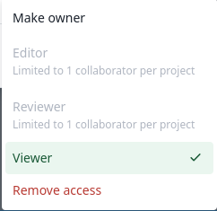
  
<strong>Figure 2.2: Collaboration Limit</strong>

#### 2.3.2 Offline Compilation and Resilience

Most web-based editors do not support native offline compilation. As seen in Figure
2.3, users are often forced to manually maintain a local TEX distribution and manage
package dependencies across different environments if internet access is lost.

  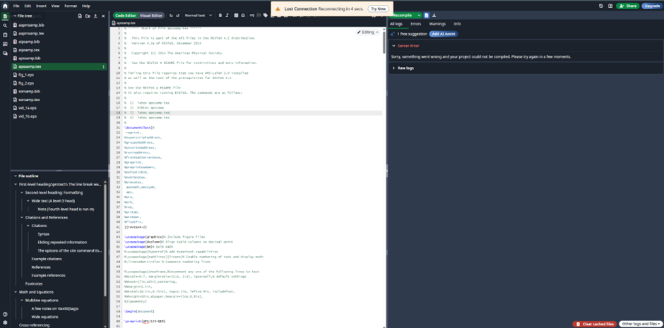
  
<strong>Figure 2.3: Lack of offline capability in Overleaf</strong>

#### 2.3.3 Access Control and Feature Gating

High-tier collaboration features such as advanced track changes and version history are frequently restricted behind premium plans. This limits accessibility for
researchers in resource-constrained environments.

  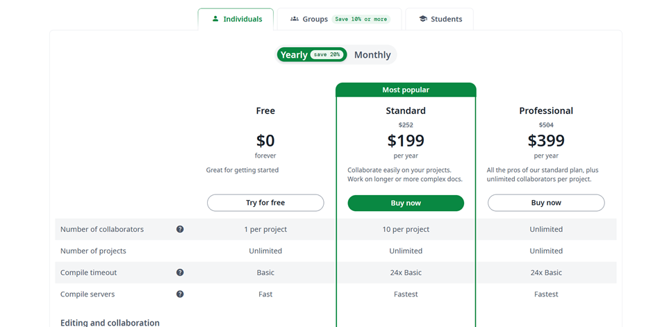
  
<strong>Figure 2.4: Premium subscription models</strong>

  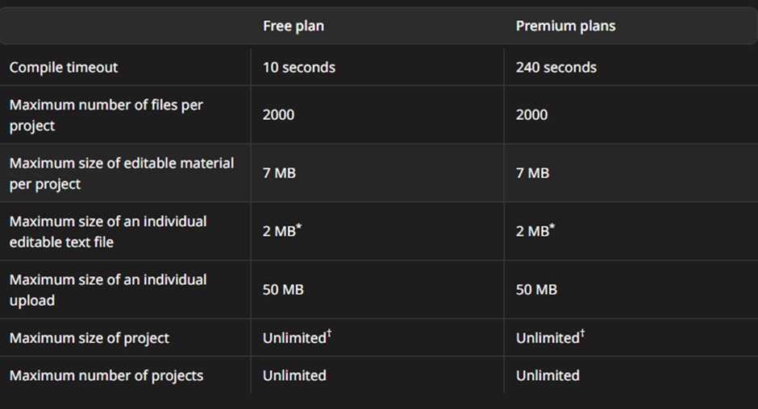
  
<strong>Figure 2.5: Premium subscription models</strong>

  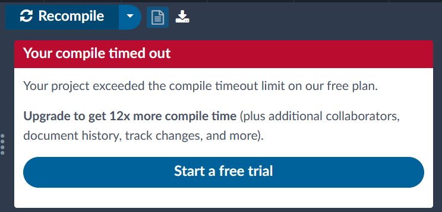
  
<strong>Figure 2.6: Compilation Limit</strong>

### 2.4 Positioning of the Proposed System

The system developed in this project, SyncTeX, addresses the limitations observed
in existing tools by combining the accessibility of cloud editors with the robustness
of local-first applications. By utilizing CRDTs(Weidner et al., 2022) for synchronization and IndexedDB for local data persistence, the platform reduces dependency
on persistent server connections. Unlike fully centralized systems, it allows users to
continue working offline and compile documents using local caching. Crucially, by
removing artificial collaborator caps and compilation timeouts, it provides a more
scalable and inclusive framework for academic collaborative writing.

---

## Chapter 3: Design and Implementation

This chapter describes the design and implementation of the project. It explains
how the system was structured, developed, and realized in practice. The chapter
includes system overview, requirements, design, implementation, algorithms, and
tools used.

### 3.1 System Overview

SyncTeX is a collaborative LaTeX editor designed to manage document synchronization, compilation, and user collaboration. The system allows multiple users
to edit documents in real time, compile LaTeX source files into PDF outputs, and
manage projects collaboratively.

#### 3.1.1 Major Components

| Component | Description |
| :--- | :--- |
| **Frontend** | Web interface for editing, previewing, and project management. |
| **Backend** | Server for synchronization, compilation orchestration, and data persistence. |
| **Database** | Stores user data, documents, and projects. |
| **Collaboration Engine** | Real-time conflict-free editing using CRDTs. |

<em>Table 3.1: Major components of the system</em>

#### 3.1.2 Interaction

Users and collaborators interact with the frontend, which communicates with the
backend over WebSockets and REpresentational State Transfer (REST) APIs. The
backend ensures synchronization, conflict resolution, and compiles LaTeX documents using the TeX Live engine.

  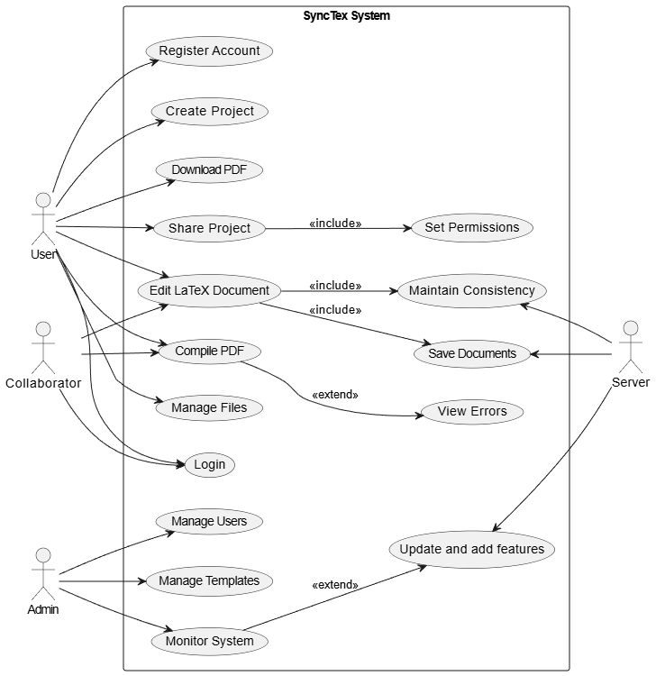
  
<strong>Figure 3.1: SyncTeX Use Case diagram</strong>

### 3.2 Key Actors

- **User**: The primary stakeholder who creates projects, manages files, and handles
document sharing.
- **Collaborator**: A secondary user who participates in editing, compiling, and logging into shared projects.
- **Admin**: Responsible for system-level maintenance, user management, and template monitoring.
- **Server**: An automated actor that handles data persistence, document consistency,
and system updates.

### 3.3 Functional Breakdown

#### 3.3.1 Core Editing & Compilation

* **Edit LaTeX Document**: The central use case for Users and Collaborators.
Saving Documents and Maintain Consistency ensure real-time collaboration.

* **Compile PDF**: Allows users to generate output. This is extended by View Errors, meaning the error interface appears only when compilation issues occur.

#### 3.3.2 Project Management

* **Share Project**: Requires the inclusion of Set Permissions to define access
levels for others.
* **File Operations**: Includes Create Project, Manage Files, and Download PDF.

#### 3.3.3 Administration & System Health

* **Monitoring**: The Admin monitors the system, which extends into Update and
add features as needed.
* **Resource Management**: Admin-specific tasks include Managing Users.

### 3.4 System Requirement Specifications

#### 3.4.1 Software Requirements

The software requirements define the functionality, quality attributes, and dependencies of the system.

##### Software Dependencies

| Component | Dependency / Description |
| :--- | :--- |
| **Frontend** | Next.js with TypeScript for building the user interface. |
| **Collaboration Engine** | Yjs (CRDT library) for real-time conflict-free synchronization. Operational based sequence CRDT. |
| **Backend** | Go for WebSocket handling, synchronization logic, and compilation orchestration. |
| **Database** | IndexedDB for offline storage; PostgreSQL/NeonDB for central persistent storage. |
| **Compiler** | TeX Live / PDFLaTeX environment for LaTeX document compilation. |
| **Communication** | WebSockets for real-time updates and REST APIs for Create, Read, Update, Delete (CRUD) operations. |
| **Deployment** | Docker for containerization and Continuous Integration / Continuous Deployment (CI/CD) pipelines for automated deployment. |

<em>Table 3.2: Software dependencies of the system</em>

##### Functional Requirements
- **1.** Document Authoring: Create, open, edit, share, and save LaTeX source
files.
- **2.** Project Management: Organize LaTeX documents into projects and folders.
- **3.** Collaboration: Support real-time concurrent editing with multiple users.
- **4.** Offline Editing: Allow users to make edits offline with automatic synchronization upon reconnection.
- **5.** Synchronization: Merge changes across clients using CRDTs without conflicts.
- **6.** Compile and Preview: Provide on-demand LaTeX compilation and preview.
- **7.** PDF Generation: Generate and allow download of publication-ready PDFs.
- **8.** Error Handling: Detect and display LaTeX compilation errors to the user.
- **9.** User Management: Manage sessions, authentication, and access to shared
documents.
##### Non-Functional Requirements
- **1.** Scalability: Handle multiple projects and concurrent users.
- **2.** Reliability: Ensure offline edits are never lost and synchronize consistently.
- **3.** Usability: Provide an intuitive editor interface with minimal learning curve.
- **4.** Compatibility: Work across major browsers (Chrome, Firefox, Safari, Edge).
- **5.** Portability: Run without installation on any device with internet and browser
access.

#### 3.4.2 Hardware Requirements

##### Development Environment
- **Processor**: Dual-core Central Processing Unit (CPU) (Intel i5 / AMD equivalent or higher)
- **Memory**: 8 GB Random Access Memory (RAM) minimum
- **Storage**: 20 GB free disk space
- **Network**: Stable internet connection
- **Platform**: Any modern laptop/desktop running Linux, Windows, or macOS

##### Server Environment
- **Processor**: Quad-core CPU
- **Memory**: 16 GB RAM or higher
- **Storage**: 100 GB solid-state drive (SSD) for project files and compiled PDFs
- **Network**: High-speed connection with low latency
- **Docker**: runtime support for containerized deployment

### 3.5 System Design

#### 3.5.1 Architectural Design

  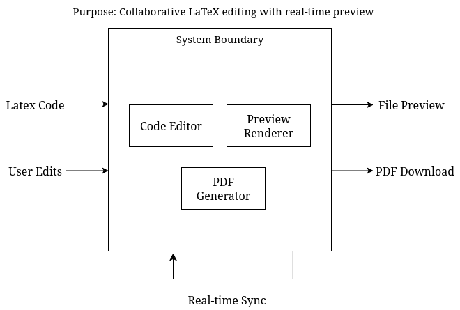
  
<strong>Figure 3.2: Architecture Diagram</strong>

The system follows a client–server architecture:
- The frontend handles editing, file management, and user interface.
- The backend manages synchronization, compilation requests, and database
operations.
- WebSockets are used for real-time updates; REST APIs handle CRUD operations.

#### 3.5.2 Module or Component Design

- **Authentication Module**: Handles user login, signup, and session management.
- **Editor Module**: Provides LaTeX editing, syntax highlighting, and live preview.
- **Collaboration Module**: Implements CRDT-based real-time synchronization.
- **Compilation Module**: Manages LaTeX compilation to PDF and error reporting.
- **Project Management Module**: Supports file operations, sharing, and permissions.
- **Admin Module**: Monitors system health and manages users.

#### 3.5.3 Database or Data Design

- IndexedDB is used for offline client storage.
- PostgreSQL/NeonDB stores persistent user, project, and document data.
- Entity-Relationship (ER) diagram captures relationships between Users, Projects,
Documents, and Permissions.

  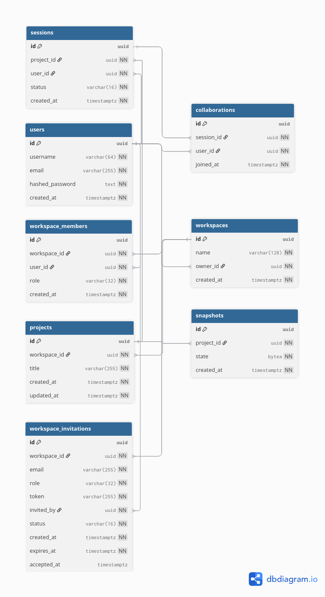
  
<strong>Figure 3.3: ER Diagram</strong>

#### 3.5.4 Sequence Diagram

  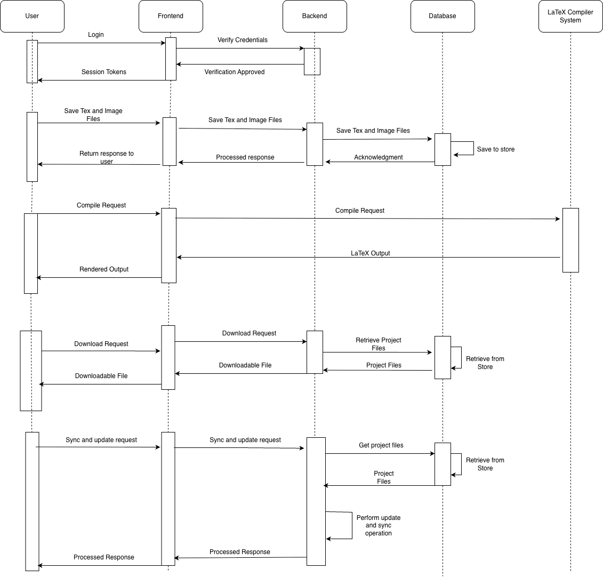
  
<strong>Figure 3.4: SyncTeX sequence diagram</strong>

SyncTeX sequence diagram demonstrates all set of operations that take place in all
user, frontend, backend and compilation environment.

### 3.6 Implementation Details

#### 3.6.1 Software Implementation

Key implementation steps:
- Setup of Next.js frontend with TypeScript and editor components.
- Integration of Yjs for conflict-free real-time synchronization.
- Backend implementation in Go with WebSockets and compilation orchestration.

- Database integration with IndexedDB and PostgreSQL for offline and persistent storage.
- Deployment using Docker and CI/CD pipelines for automated updates.

### 3.7 Algorithms and Flowcharts
- Real-time synchronization algorithm using CRDTs for conflict-free collaboration.
- LaTeX compilation workflow:
1. User triggers compilation.
2. Backend receives request and executes TeX Live.
3. Compilation output sent to client for preview or download.
4. Errors are captured and displayed in editor interface.

### 3.8 Tools and Technologies Used
- **Programming Languages**: TypeScript, Go
- **Frameworks**: Next.js
- **Libraries**: Yjs, IndexedDB
- **Database**: PostgreSQL / NeonDB
- **Deployment**: Docker, CI/CD pipelines

### 3.9 Summary of Design and Implementation

This chapter detailed the design and implementation of the SyncTeX system. The
system architecture, modules, database design, functional and non-functional requirements, software dependencies, and algorithms were presented. SyncTeX successfully integrates real-time collaborative editing, offline support, LaTeX compilation, and project management into a single platform.

---

## Chapter 4: Results and Discussion

This chapter explains the results obtained after developing the SyncTeX. It discusses
the features that were successfully implemented, how well the system performs, and
how effectively it meets the project goals. The chapter also describes the challenges
faced during development, the limitations of the current system, and the key lessons
learned from the implementation process.

### 4.1 Features

#### 4.1.1 Collaborative Editing and conflict free synchronization

- Multiple users can edit the same LaTeX document simultaneously.
- WebSockets ensure low-latency synchronization

#### 4.1.2 Offline first document editing and local persistence

- Users can edit document without online connectivity.
- Documents saved in the local IndexedDB and changes are merged when connection is live.

#### 4.1.3 Server Side Latex to PDF generation and download

- Users can download their latex document rendered as a pdf from the server.

#### 4.1.4 Custom lightweight LaTex Parser and preview

• Custom LaTex parser supporting offline compile functionality.
- Users can trigger compilation and preview document in the preview window.
- Recursive Descent Parsing handles basic LaTex commands, KaTex to handle
mathematical equations with error messages on parsing error.

### 4.2 Results and Performance Analysis

Major features of the system are demonstrated under this section:

  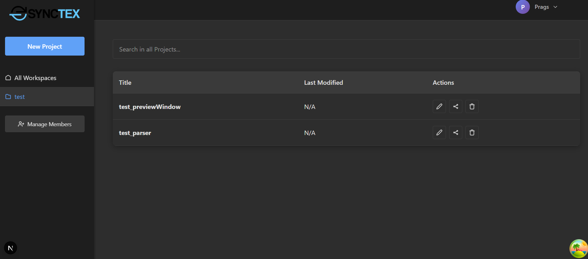
  
<strong>Figure 4.1: Workspace Management</strong>

A user can have multiple projects they can be working on or multiple documents
under the same project. The workspace lists all the related or shared work under
that user.

  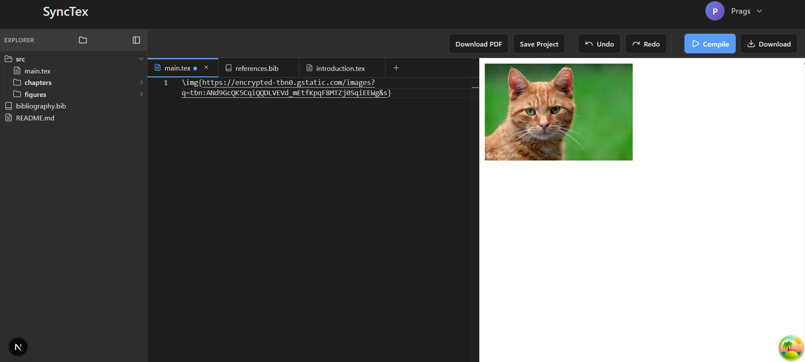
  
<strong>Figure 4.2: LaTeX Preview compilation</strong>

The Parser compiles latex into a html markup and returns that in a preview window.

  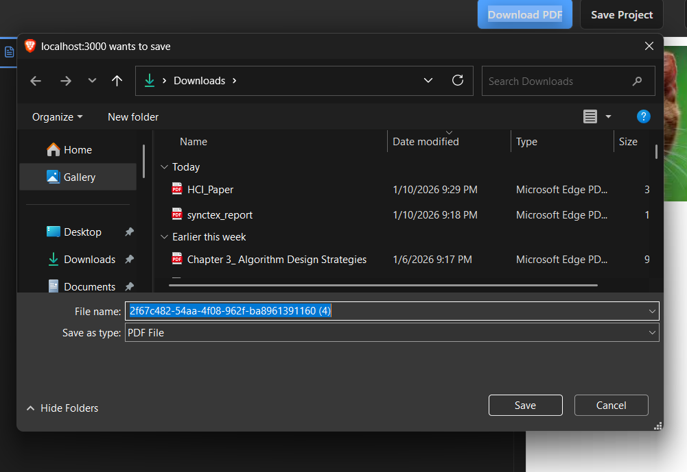
  
<strong>Figure 4.3: Download PDF feature</strong>

The DownloadPDF feature returns a PDF file to the user of their document.

  
  
<strong>Figure 4.4: Save Feature</strong>

The save feature the latest working instance of the document in the database

### 4.3 Comparison with Objectives or Existing Systems

Latex systems like Overleaf, Papeeria and TeXPage exist with similar objectives
and functionality :
- All other online LaTex editor support collaborative editing which is also supported in SyncTeX.
- LaTeX to PDF is also a highlighting feature present in both existing system
and SyncTeX.
- SyncTeX is an offline first system where users can edit and compile to preview
without an active connection unlike other live Tex editing systems.

### 4.4 Challenges

Some major challenges that were faced and tackled during project development :
##### 1. Custom LaTeX to HTML parser
Developing a reliable custom LaTeX to HTML parser was a significant challenge. The parser needed to handle a wide variety of LaTeX commands,
accurately render mathematical expressions, and support the import of images. Ensuring that all these elements were correctly parsed and displayed in
HTML while maintaining performance and stability added to the complexity
of the task.
We implemented the parser in TypeScript with a modular architecture, allowing each LaTeX component—commands, math expressions, and images—to
be processed independently. Extensive testing with different LaTeX documents helped us identify edge cases, and we gradually refined the parsing
logic to ensure accurate and efficient conversion to HTML. While we have
successfully implemented the basic LaTeX commands, there is still a large
set of commands and features yet to be supported. These will be addressed in
future work to further enhance the parser's capabilities.
##### 2. File tree management
Managing multiple source files, images, and supplementary documents within
SyncTeX posed another challenge. A poorly organized file structure could
lead to confusion and inefficiency, especially for larger projects with many
assets.
We implemented a structured and functional file tree that clearly organizes
all associated resources. Users can navigate projects easily, with intuitive
expand/collapse functionality and quick access to all documents and images.
This approach ensured that large and complex projects remain manageable
and user-friendly.

##### 3. Collaborative editing and persistence using WebSockets
Enabling real-time collaborative editing for multiple users introduced challenges in synchronizing updates and maintaining data consistency. Without
proper handling, concurrent edits could overwrite changes, leading to data
loss or inconsistencies across clients.
We built a WebSocket-based architecture that tracks edits in real time and ensures synchronized updates across all connected clients. A robust persistence
mechanism was also added, storing changes on the server to prevent data loss
and allow seamless continuation of collaborative work.
##### 4. Concurrency issues with Go
Using multiple goroutines for simultaneous tasks initially caused concurrency
issues, sometimes breaking the system due to race conditions and unsynchronized access to shared resources.
We resolved this by implementing proper synchronization mechanisms, including mutexes and channels, to manage concurrent goroutines safely. This
ensured that shared resources were accessed in a controlled manner, preventing race conditions and stabilizing the system even under heavy simultaneous
operations.

### 4.5 Discussion

The results demonstrate that SyncTeX successfully achieves its primary objectives
of collaborative, offline-first LaTeX document editing with custom parsing and rendering capabilities. Real-time collaboration using WebSockets provides low-latency
synchronization and supports concurrent editing, fulfilling the system's collaboration goals, although minor delays were observed under heavy concurrent usage.
The offline-first design, supported by local persistence through IndexedDB, allows uninterrupted editing without network connectivity and effective synchronization upon reconnection. This feature distinguishes SyncTeX from existing online
LaTeX editors and significantly improves usability in low-connectivity environments.
The custom lightweight LaTeX parser enables real-time HTML previews and supports core commands, mathematical expressions, and images. However, incomplete
support for advanced LaTeX features limits compatibility with complex documents.
Server-side PDF generation successfully delivers publication-ready output, though
it introduces a dependency on server availability.
Overall, the findings indicate that SyncTeX meets its intended objectives while
highlighting areas for future improvement, particularly in parser completeness and
system scalability.

---

## Chapter 5: Conclusion and Future Works

### 5.1 Limitations

Despite achieving its core goals, the current implementation of SyncTeX has several
limitations that should be acknowledged.
##### 1. Limited LaTeX Package and Environment Support
Only a portion of frequently used LaTeX environments and commands are
presently supported by the proprietary LaTeX-to-HTML rendering engine. Complex visuals, bibliographies, custom class files, and domain-specific extensions are examples of advanced packages that might not appear correctly in
the real-time preview. Even though a full TeX distribution on the backend
handles full PDF compilation, complicated documents may still have differences between the live preview and final PDF output.
##### 2. Performance Constraints for Large-Scale Documents
CRDTs guarantee accuracy and conflict-free synchronization, but as document size and editing history rise, so does their memory and processing cost.
Performance may deteriorate on low-end devices for very big documents or
projects with a lengthy history of collaboration, especially during initial document loading or synchronization following extended offline usage.
##### 3. Scalability and Load Handling
Small-scale situations have been the main focus of testing the existing backend architecture. WebSocket handling and LaTeX compilation are examples
of server-side components that may encounter bottlenecks under heavy concurrent usage, such as in large classes or institutional deployments. Under
high demand, compilation delay may rise in the absence of sophisticated load
balancing or work scheduling.
##### 4. Security and Access Control Limitations
Advanced security features like role-based permissions, fine-grained document access policies, end-to-end encryption for document contents, and institutional authentication (e.g., LDAP or OAuth-based SSO) are not yet supported, despite the implementation of basic authentication and access control
mechanisms. This restricts adoption in settings where data governance regulations are stringent.

##### 5. Browser and Device Dependence
Despite being cross-platform, the system's performance is intrinsically reliant on client-side resources and browser capabilities. A seamless editing
experience might not be possible with outdated browsers or devices with little memory and processing capacity, especially when several contributors are
working at once.
##### 6. Testing and Evaluation Scope
The evaluation of SyncTeX has primarily focused on functional validation
rather than extensive quantitative benchmarking. Comprehensive stress testing, usability studies, and long-term reliability assessments have not yet been
conducted, which limits the ability to generalize performance claims across
diverse real-world usage scenarios.

### 5.2 Future Enhancements

Several improvements and extensions can be pursued to enhance SyncTeX and
transform it from a prototype into a production-ready system.
##### 1. Expanded LaTeX Grammar and Package Support
In order to accommodate a wider variety of settings, packages, and document
types, future development may concentrate on expanding the LaTeX parser and
renderer. Preview accuracy might be increased and discrepancies between
preview and final output could be decreased by integrating with well-known
LaTeX parsing tools or incremental compilation strategies.
##### 2. Advanced Collaboration Features
Collaborative processes would be greatly enhanced with features like version
history, inline comments, change tracking, and document diff visualization.
Reproducibility and advanced project management may be further made possible by integration with Git-based version control.
##### 3. Scalability and Distributed Compilation
The backend might be expanded with load balancers, task queues, and distributed compilation workers to accommodate large-scale deployments. This
would make the system appropriate for institutional and enterprise-level deployment by increasing throughput and decreasing compilation lag during
periods of high demand.
##### 4. AI-Assisted Writing and Error Detection
AI-based tools for grammar checking, citation recommendations, syntax mistake detection, and semantic analysis of LaTeX manuscripts may be incorporated into future iterations of SyncTeX. These additions would increase efficiency, particularly for academic authors and inexperienced users.

---

## References

arXiv (n.d.). Tex, latex, etc. https://info.arxiv.org/help/tex.html. Accessed 2025-0905.
Inscrive.io (n.d.). Collaborative latex with ai and sso. https://inscrive.io.
LaTeX Project (n.d.). Latex — a document preparation system. https://www.latexproject.org.
Overleaf (n.d.). About overleaf. https://www.overleaf.com/about.
Typewings (n.d.). Visual latex editor. https://typewings.com.
Weidner, M., Qi, H., Kjaer, M., Pradeep, R., Geordie, B., Zhang, Y., Schare, G.,
Tang, X., Xing, S., and Miller, H. (2022). Collabs: A flexible and performant
crdt collaboration framework. https://arxiv.org/abs/2212.02618. arXiv preprint
arXiv:2212.02618.
